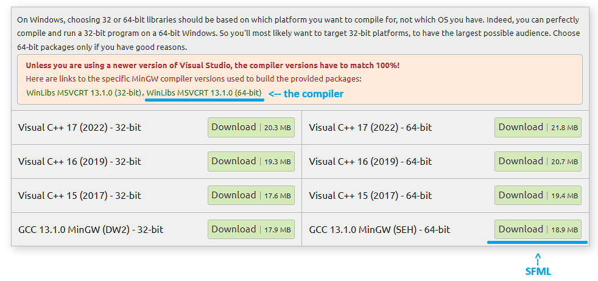

# Obvious Captcha

## Compilation

[SFML](https://www.sfml-dev.org/download/sfml/2.6.1/) and the g++ version provided by SFML are required.



Simply run the following command with the corresponding compiler and SFML paths:

```txt
C:\compiler_path\mingw64\bin\g++.exe -DSFML_STATIC .\obvious.cpp -I"C:\sfml_path\SFML-2.6.1\include" -L"C:\sfml_path\SFML-2.6.1\lib" -static -lsfml-graphics-s -lsfml-window-s -lsfml-system-s -lopengl32 -lfreetype -lwinmm -lgdi32 -mwindows -o obvious.exe
```

[Compiled Windows executable](https://github.com/k3ntd4i/Obvious_Captcha/releases/tag/v1.0.0)
